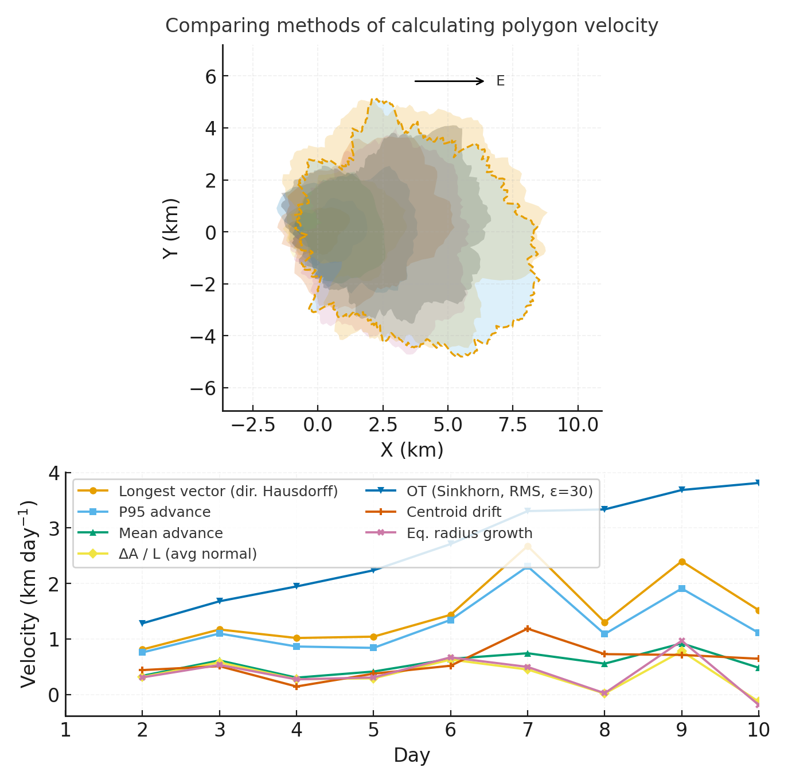

# Wakpa Yamni: Resilience for Hydrologic Events Management

**Impact:** In three days, Group 15 _Wakpa Yamni_ is prototyping data stories and decision aids that help water managers study hydrologic extremes and plan resilient responses.

**[Project brief (PDF)](assets/Seven%20ways%20to%20measure%20fire%20polygon%20velocity-4.pdfa) · [View code](https://github.com/CU-ESIIL/resilience-rare-hydrologic-events-management-innovation-summit-2025__15/blob/main/code/fired_time_hull_panel.ipynb) · [Explore data](https://github.com/CU-ESIIL/resilience-rare-hydrologic-events-management-innovation-summit-2025__15/blob/main/code/prism_quicklook.py)**

> **About:** This is a public, in-progress record of a 3-day project at the Innovation Summit.

---

- [Day 1 — Define & Explore](#day-1--define--explore)
  - [Our product](#our-product-)
  - [Our questions](#our-questions-)
  - [Hypotheses / intentions](#hypotheses--intentions)
  - [Why this matters (the “upshot”)](#why-this-matters-the-upshot-)
  - [Field notes / visuals](#field-notes--visuals)
  - [Interactive map](#interactive-map)
- [Day 2 — Data & Methods](#day-2--data--methods)
  - [Coding / Tasks](#coding--tasks)
  - [Theory and Practice](#theory-and-practice)
  - [Data sources we’re exploring](#data-sources-were-exploring-)
    - [AI Prompt Engeneering](#ai-prompt-engeneering)
    - [Expert Python and R Coding](#expert-python-and-r-coding)
- [Wakpa Yamni Team in Action!](#wakpa-yamni-team-in-action)

## Day 1 — Define & Explore
*Focus: questions, hypotheses, context; add at least one visual (photo of whiteboard/notes).*

### Our product 📣
This is a comparative study of the Snake, Green, and Wind River Basins in the western U.S. Our goal is to examine how hydrology, governance, and management interact within and across these basins. We are focusing on three main aspects: hydrology; water management, and socioeconomic/legal frameworks. We are intersted in how these aspects interact to influence snowpack, climate dynamics, and streamflow. Data sources include but are not limited to: USGS streamflow and groundwater records, NOAA/NCEI climate data, PRISM and/or Daymet for weather, calculated indices like NDWI, soils and soil moisture, and ESA WorldCover, amongst others.

### Our questions 📣
- How are current river management practices affecting communities and ecosystems?
- What is the response of river communities and ecosystems to hydrologic and meteorologic events?
- How do we measure response and resilience?

### Hypotheses / intentions
We envision our datasets aligning with earth, air, fire, and water, and, considering the RAD model,
have simplified management strategies in our study area to align these three basins as follows:
Snake River management priority (resist); Green River basin (direct); and Wind River (accept).
We plan to further develop our conceptual and hydrologic frameworks for these basins to assess hydrologic parameters,
management strategies, and other factors both within and across these basins.

### Why this matters (the “upshot”) 📣
This is a unique study area.
The Snake River is a major interstate river with heavy agriculture and large dams, in Idaho, Wyoming, and Washington.
A standout feature is the Snake River Plain Aquifer, a highly productive yet fragile groundwater system flowing through fractured basalt.
Water moves quickly through this aquifer and discharges into the Snake River, supporting irrigation, hydropower, and ecosystems.
Intensive pumping in the eastern plain has lowered water tables though.

### Field notes / visuals
The Green River, originating in Wyoming, is a major tributary of the Colorado River and goverened by Colorado River Compact allocations.
The Wind River is smaller but hydrologically important, with local agriculture and tribal water rights shaping governance.
These differences make a comparative study especially interesting, as each basin has distinct management approaches, power structures, and constraints.

The Snake River Basin is managed by federal agencies (Bureau of Rec and Army Corps), and Idaho state law.
Water use is dominated by irrigation, hydropower, and aquaculture, with large, wealthy landowners and irrigation districts holding significant influence.
Issues include balancing hydropower and irrigation, salmon restoration, and groundwater depletion in the aquifer.
In this basin, economic interests and infrastructure drive management decisions to resist changes.

The Green River Basin is governed by the Colorado River Compact.
Agriculture is the main water use (alfalfa and cattle), and dominates water demand, but municipal and energy needs are growing.
Declining snowpack and drought pressures challenge fair water allocation.
Compact obligations limit flexibility, creating a management narrative dominated by the desire to direct water in ways that might not be supportive of the natural hydrologic regime.

The Wind River Basin is unique because tribal sovereignty is central. The Shoshone and Arapahoe Tribes hold water rights confirmed through the Big Horn adjudication. Governance involves tribal, state, and federal agencies, supporting tribal agriculture, ranching, and cultural uses. Challenges include enforcing water rights against state pushback from Wyoming, funding infrastructure, and cultural values.
Across the basins, there are several comparative angles for us to assess: governance differences (economic power in Snake, legal compacts in Green, tribal sovereignty in Wind); equity (who benefits and who bears scarcity; and climate adaptation (flexibility versus lock-in; and narratives of power, economic influence, legal obligations, and cultural authority).

#### Interactive map

---

## Day 2 — Data & Methods

### Coding / Tasks
Two distinct but synergistically interconnected approaches to coding.
These are complementary and will, over time, inform each other.
For instance, expert coding by team members will enable us to design targeted AI prompts,
while AI-generated code and data will suggest novel workflows at scale.

The AI no-code approach provides a new set of data worth mining in terms of
(a) code workflow ideas and (b) simulated data.
This will take novel, systems-level thinking to understand,
much like what happened with the 
arrival of vast collections of remote-sensing maps a half-century ago
and, in another setting over the past two decades,
genomic and genetic data (microarrays and DNA sequences)
on ever large collections of subjects.
In many ways AI no-code generation will likely raise more questions than answers:
it requires us to `go slow` to understand what is offered
rather than to `go fast` and assume (too easy) solutions.
Still, AI empowers us to raise questions in intuitive ways without
necessarily getting bogged down in the tedium of coding.

The python/R code approach is informed by years of expertise in earth science and coding
among our team members, who have creative insights about what is important to pursue.
The creative interaction among team members will drive innovation
that bridges across approaches.
These insights and deep perspectives are impossible (at present, and maybe for a long time)
to achieve _de novo_ with AI.

- AI tool from [Tyson Swetnam](https://tysonswetnam.com/)
  - no-code as starting point
  - <https://portal.esiil.org> and [AI Verde](https://learning.cyverse.org/ai/verde/)
  - see Tyson results in CyVerse shared folder
[esiil/summit2025_demo/wyoming_rivers_project](https://de.cyverse.org/data/ds/iplant/home/shared/esiil/summit2025_demo/wyoming_rivers_project)
- python or R code individual efforts
  - experts in team will develop algorithms drawing on their experience
  - utilize skills and tools from [ESIIL Analytics Library](https://cu-esiil.github.io/analytics-library/)
and [EarthDataAnalytics Course](https://github.com/byandell-envsys/EarthDataAnalytics)

### Theory and Practice
Study real-world interconnect examples of RAD using earth/air/fire/water measurements

- RAD played out in watersheds
  - **Resist**: Snake River / wealth & power / protect property
  - **Accept**: Wind River / TEK / live with relatives
  - **Direct**: Green River / agribusiness / improve yield

### Data sources we’re exploring 📣

#### AI Prompt Engeneering
_Prompt delivered to Claude for AI rendering:_ We want to create a new scientific project. The goal is to download data from three adjacent rivers in Wyoming: Snake River, Green River and Wind River. These should be bounded by their headwaters (watershed boundaries by HUC)
and the second major reservoir for each river. I want to download
atmospheric (precipitation and NDVI and PRISM),
streamflow (USGS water, NDWI),
land cover (NLCD or ESA World Cover or EMIT)
and
soil moisture (Palmer drought stress index or NASA SMAP)
data.

Download the data for a range of dates from 1994-2024. Store the data in this project folder.

Write python / R scripts to analyze the monthly to yearly variations in vapor pressure deficit and potential evapotranspiration for the sites.

_Create a topographic map with river features including DEM that delineates the three watersheds in their bounded regions._

Create beautiful plots that describe these patterns and highlight the variations between them.

We recommend that you create and save a plan.md that documents how you expect to execute these steps first, before using the MCP tools.

- see Tyson results in CyVerse shared folder
[esiil/summit2025_demo/wyoming_rivers_project](https://de.cyverse.org/data/ds/iplant/home/shared/esiil/summit2025_demo/wyoming_rivers_project)
- <https://portal.esiil.org> new CyVerse interface
- CyVerse [AI Verde](https://learning.cyverse.org/ai/verde/) platform

#### Expert Python and R Coding

Some data images from expert approach:

Palmer Drought Severity Index (PDSI),Yearly Average Temperature and Precipitation from 
[NOAA NCEI](https://www.ncei.noaa.gov/access/monitoring/weekly-palmers/time-series/4802)

#### SNAKE River Drainage Climate Division 2:

#### GREEN and BEAR River Drainage Climate Division 3:

#### WIND River Climate Division 9:

PDSI for Snake, Green and Wind Rivers from Drought.gov:
[Palmer drought index (PDSI)](https://www.drought.gov/data-maps-tools/us-gridded-palmer-drought-severity-index-pdsi-gridmet)

|  |  |  |
|----------------------------|----------------------------|---------------------------|

[Normalized Difference Water Index (NDWI)](https://www.geographyrealm.com/normalized-difference-water-index-flooding/) for 2024

NDWI over time

Locations of NWS and RAWS weather stations:
[MESOWEST Link](https://mesowest.utah.edu/cgi-bin/droman/mesomap.cgi?state=WY&rawsflag=3)

## Wakpa Yamni Team in Action!

|  |  |
|----------------------------|----------------------------|

|  |  |
|----------------------------|----------------------------|

 

_Photos courtesy of [Jim Sanovia](https://www.linkedin.com/in/sanovia) and [Nate Quarderer](https://nquarder.github.io/), 24-26 September 2025._

---

## Following kept but not used

### Inspirations (papers, datasets, tools)
- Publication: [NOAA Atlas 14 Guidance](https://hdsc.nws.noaa.gov/hdsc/pfds/)
- Dataset portal: [USGS StreamStats](https://streamstats.usgs.gov/)
- Tool/tech: [FEMA Hazus flood mitigation library](https://www.fema.gov/flood-maps/tools-resources/hazus)

- **NOAA Atlas 14 extreme precipitation grids** — baseline design storms to benchmark current planning thresholds.

  
  [Raw photo location: explore_data_plot.png](https://github.com/CU-ESIIL/resilience-rare-hydrologic-events-management-innovation-summit-2025__15/blob/main/docs/assets/explore_data_plot.png)
  *Snapshot: 24-hour return-period rainfall values for pilot watersheds.*

- **NASA IMERG precipitation time series** — near-real-time anomaly tracking for event attribution.
- **US Census SVI indicators** — spatial context for vulnerable populations potentially affected by flash flooding.

### Methods / technologies we’re testing 📣
- Approach 1 (e.g., time-series break detection)
- Approach 2 (e.g., random forest on features)
- Visualization (e.g., map tiles, small multiples)

### Challenges identified
- Data gaps / quality issues
- Method limitations / compute constraints
- Open questions we need to decide on

### Methods / technologies we’re testing 📣
- Rainfall frequency adjustment factors derived from downscaled climate projections.
- Rapid flood exposure mapping using Google Earth Engine and publicly available elevation models.
- Lightweight dashboards assembled with Plotly Express for communicating uncertainty.

### Challenges identified
- Reconciling spatial resolution differences between gridded precipitation and community-level indicators.
- Limited compute time for running high-resolution hydrologic models within the sprint window.
- Need for vetted narratives that balance urgency with uncertainty when briefing decision makers.

### Visuals
<!-- EDIT: Swap examples; keep file sizes modest. -->

#### Static figure

[Raw photo location: figure1.png](https://github.com/CU-ESIIL/resilience-rare-hydrologic-events-management-innovation-summit-2025__15/blob/main/docs/assets/figure1.png)
*Figure 1.* One line on what this suggests.

#### Animated change (GIF)

[Raw photo location: change.gif](https://github.com/CU-ESIIL/resilience-rare-hydrologic-events-management-innovation-summit-2025__15/blob/main/docs/assets/change.gif)
*Figure 2.* One line on what changes across time.

---

## Final Share Out — Insights & Sharing
*Focus: synthesis; highlight 2–3 visuals that tell the story; keep text crisp. Practice a 2-minute walkthrough of the homepage 📣: Why → Questions → Data/Methods → Findings → Next.*

[Raw photo location: team_photo.jpg](https://github.com/CU-ESIIL/resilience-rare-hydrologic-events-management-innovation-summit-2025__15/blob/main/docs/assets/team_photo.jpg)

### Findings at a glance 📣
<!-- EDIT: 2–4 bullets, each a headline in plain language with a number if possible. -->
- Headline 1 — what, where, how much
- Headline 2 — change/trend/contrast
- Headline 3 — implication for practice or policy
  
### Visuals that tell the story 📣

[Raw photo location: fire_hull.png](https://github.com/CU-ESIIL/resilience-rare-hydrologic-events-management-innovation-summit-2025__15/blob/main/docs/assets/fire_hull.png)
*Visual 1.* Swap in the primary graphic that clearly communicates your core takeaway.

[Raw photo location: hull_panels.png](https://github.com/CU-ESIIL/resilience-rare-hydrologic-events-management-innovation-summit-2025__15/blob/main/docs/assets/hull_panels.png)
*Visual 2.* Use a complementary panel, collage, or set of snapshots that reinforces supporting evidence.

[Raw photo location: main_result.png](https://github.com/CU-ESIIL/resilience-rare-hydrologic-events-management-innovation-summit-2025__15/blob/main/docs/assets/main_result.png)
*Visual 3.* Highlight an additional visual that captures a secondary insight or next step.

<iframe
  title="Short explainer video (optional)"
  width="100%" height="360"
  src="https://www.youtube.com/embed/ASTGFZ0d6Ps"
  frameborder="0" allow="accelerometer; autoplay; clipboard-write; encrypted-media; gyroscope; picture-in-picture; web-share"
  allowfullscreen></iframe>

### What’s next? 📣
- Immediate follow-ups
- What we would do with one more week/month
- Who should see this next

---

## Featured links (image buttons)
<table>
<tr>
<td align="center" width="33%">
  <a href="assets/Seven%20ways%20to%20measure%20fire%20polygon%20velocity-4.pdfa"> <strong>Read the brief</strong></a>
</td>
<td align="center" width="33%">
  <a href="https://github.com/CU-ESIIL/resilience-rare-hydrologic-events-management-innovation-summit-2025__15/blob/main/code/fired_time_hull_panel.ipynb"> <strong>View code</strong></a>
</td>
<td align="center" width="33%">
  <a href="https://github.com/CU-ESIIL/resilience-rare-hydrologic-events-management-innovation-summit-2025__15/blob/main/code/prism_quicklook.py"> <strong>Explore data</strong></a>
</td>
</tr>
</table>

---

## Team
| Name | Role | Contact | GitHub |
|------|------|---------|--------|
| Jane Doe | Lead | jane.doe@example.org | @janedoe |
| John Smith | Analyst | john.smith@example.org | @jsmith |

---

## Storage

Code
Keep shared scripts, notebooks, and utilities in the [`code/`](https://github.com/CU-ESIIL/resilience-rare-hydrologic-events-management-innovation-summit-2025__15/tree/main/code) directory. Document how to run them in a README or within the files so teammates and visitors can reproduce your workflow.

Documentation
Use the [`docs/`](https://github.com/CU-ESIIL/resilience-rare-hydrologic-events-management-innovation-summit-2025__15/tree/main/docs) folder to publish project updates on this site. Longer internal notes can live in [`documentation/`](https://github.com/CU-ESIIL/resilience-rare-hydrologic-events-management-innovation-summit-2025__15/tree/main/documentation); summarize key takeaways here so the public story stays current.

---

## Cite & reuse
If you use these materials, please cite:

> Innovation Summit 2025 Team 15. (2025). *Resilience for Rare Hydrologic Events Management*. https://github.com/CU-ESIIL/resilience-rare-hydrologic-events-management-innovation-summit-2025__15

License: CC-BY-4.0 unless noted. See dataset licenses on the **[Data](data.md)** page.

---

<!-- EDIT HINTS
- Upload images to docs/assets/ and reference as assets/filename.png
- Replace placeholder content with your team's updates after each sprint session.
- Summaries should be short and action-focused so visitors can quickly understand your progress.
-->
