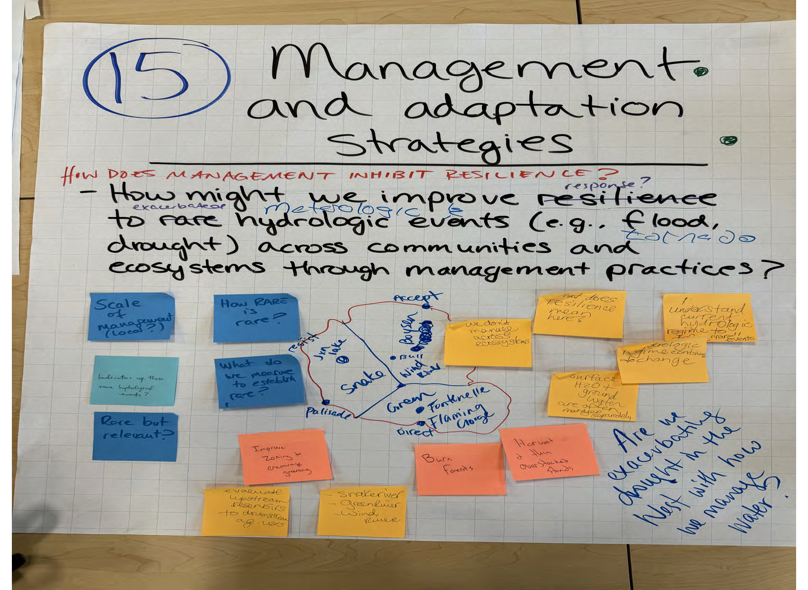
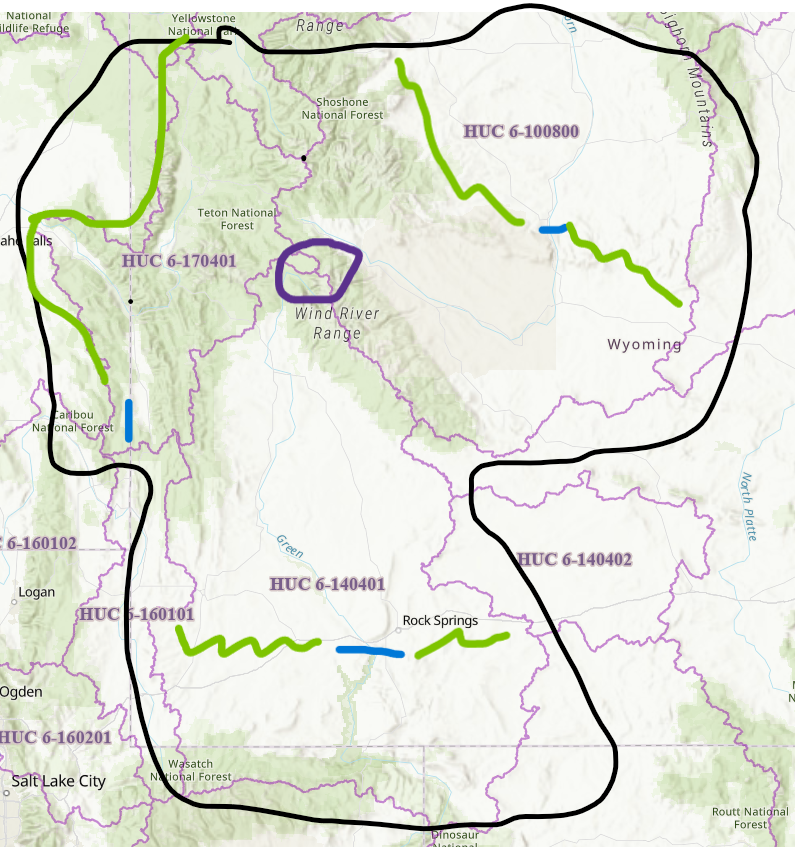

# Group Notes — Resilience for Rare Hydrologic Events Management

Use this shared notebook to capture meeting highlights, decisions, and follow-up tasks for Innovation Summit Group 15.

- Summarize key takeaways after each working session.
- Note data sources, analysis ideas, and open questions.
- Assign owners and due dates for action items so nothing slips through the cracks.
- Drop helpful links, screenshots, or file references so the team can find them later.

## Questions

- How are current river management practices affecting communities and ecosystems?
- What is the response of river communities and ecosystems to hydrologic and meteorologic events?
- How do we measure response and resilience?

Original question:

- How might we improve resilience (define?) to rare hydrologic and meteorologic events (e.g. flood, drought, tornado) across communities and ecosystems through management practices?

## Study Area

- Green, Snake and Wind Rivers and their watersheds
  - Snake: Resist due to protect property
  - Wind: Accept due to Tribal influence
  - Green: Direct via ag practices
  - [Three Waters Mountain](https://mapcarta.com/24027664)
- bounded by second major reservoir for each river
- dams and lakes

## Measurements

- water-drought relationship
- Watersheds and their changes over time.
- Response variables (some possible metrics)
  - air: atmospheric -- mean, median, min, max daily %RH 
  - water: streamflow -- mean, median, sd, IQR, 5%, 95% of mean daily streamflow at gages
  - earth: land cover -- fraction of NLCD
  - fire: soil moisture -- unsure how to estimate.
 
## Goals
### Time frame

- Short term: during this workshop--getting basics in one day
- Mid term: WG proposal by Nov 21
- Long term: understand how these three watersheds evolved over 30 years

### Coding / Tasks
Two distinct but interconnected approaches to coding.

- AI tool from Tyson
  - no-code as starting point
  - <https://portal.esiil.org> and [AI Verde](https://learning.cyverse.org/ai/verde/)
  - see Tyson results in CyVerse shared folder
[esiil/summit2025_demo/wyoming_rivers_project](https://de.cyverse.org/data/ds/iplant/home/shared/esiil/summit2025_demo/wyoming_rivers_project)
- python or R code individual efforts
  - experts in team will develop algorithms drawing on their experience
  - utilize skills and tools from [ESIIL Analytics Library](https://cu-esiil.github.io/analytics-library/)
and [EarthDataAnalytics Course](https://github.com/byandell-envsys/EarthDataAnalytics)

### Theory and Practice
Study real-world interconnect examples of RAD using earth/air/fire/water measurements

- RAD played out in watersheds
  - **Resist**: Snake River / wealth & power / protect property
  - **Accept**: Wind River / TEK / live with relatives
  - **Direct**: Green River / agribusiness / improve yield

### Team member goals

- career advancement
- win-win multiple use of code or results

## Coordinate Reference System Projections

See [Devise](https://devise.uwyo.edu/app)

- [EPSG:26912](https://spatialreference.org/ref/epsg/26912/)
- UTM 12N (study area)
- [NAD83](https://www.ngs.noaa.gov/datums/horizontal/north-american-datum-1983.shtml)
- [HUC](https://www.usgs.gov/media/images/regional-hydrologic-unit-map) levels 6 and 8
  - HUC 6 170401 Snake
  - HUC 6 100800 Wind
  - HUC 6 140401 Green
  - [HUC National Map Viewer](https://apps.nationalmap.gov/viewer/)
- [USGS LiDAR Report](https://rockyweb.usgs.gov/vdelivery/Datasets/Staged/Elevation/metadata/UT_Zion_2015/UT_ZionNP-QL1_2016/reports/Zion%20National%20ParkUSGS%20QL1%20and%20QL2%20Lidar%20Report.pdf)

## Maps

- [landmapr](https://github.com/byandell-envsys/landmapr) R package for native-land and census data
- <https://native-land.ca/>
- [wakpa_yamni_kin](https://github.com/CU-ESIIL/resilience-rare-hydrologic-events-management-innovation-summit-2025__15/blob/main/data/wakpa_yamni_kin.kml) (KML file for ARCInfo)

## Draft AI Task using Claude and MCP
**_This comes from Brian and Jason discussion with Tyson about using 
[Claude](https://claude.ai) 
and 
[Model Context Protocol (MCP)](https://modelcontextprotocol.io/) to automate development of GitHub repo._**

### Tyson Prototype Task
I want to create a new scientific project. The goal is to download data from three different NEON sites across a broad climatic range. I want to download the temperature, precipitation, and vapor pressure data for a desert site (SRER), a montane site (RMNP), and a tropical site in Puerto Rico (I cannot remember its site name).

Download the data for a range of dates from 2020-2024. Store the data in this project folder.

Write python scripts to analyze the daily to monthly variations in vapor pressure deficit, and potential evapotranspiration for the sites.

Create beautiful plots that describe these patterns and highlight the variations between them.

I recommend that you create and save a plan.md that documents how you expect to execute these steps first, before using the MCP tools.

### Draft Group 15 Task
I want to create a new scientific project. The goal is to download data from three adjacent rivers in Wyoming: Snake River, Green River and Wind River. These should be bounded by their headwaters (watershed boundaries by HUC)
and the second major reservoir for each river. I want to download
atmospheric (precipitation and NDVI and PRISM),
streamflow (USGS water, NDWI),
land cover (NLCD or ESA World Cover or EMIT)
and
soil moisture (Palmer drought stress index or NASA SMAP)
data.

Download the data for a range of dates from 1994-2024. Store the data in this project folder.

Write python / R scripts to analyze the monthly to yearly variations in vapor pressure deficit and potential evapotranspiration for the sites.

_Create a topographic map with river features including DEM that delineates the three watersheds in their bounded regions._

Create beautiful plots that describe these patterns and highlight the variations between them.

I recommend that you create and save a plan.md that documents how you expect to execute these steps first, before using the MCP tools.

### Results
This was run by Tyson Swetnam and are shared at
[CyVerse shard folder home/shared/esiil/summit2025_demo/wyoming_rivers_project](https://de.cyverse.org/data/ds/iplant/home/shared/esiil/summit2025_demo/wyoming_rivers_project?selectedOrder=asc&selectedOrderBy=name&selectedPage=0&selectedRowsPerPage=100)

## Socioeconomic Forcings (Pseudomodel based on RAD Framework)
- Green, Snake and Wind Rivers and their watersheds stakeholders are hypothesized to place different values on water use.
  *hypothesized reponses based on a mostly uniformed prior*
  - Snake: Resistance to water and landuse changes that might affect property values for wealthy land owners
  - Wind: Accept due low socioeconomic power. Engineered solutions are not generally the preferred alternative.
  - Green: Direct changes in water use to favor production of food crops -- water is managed towards the storage of irrigation water.

### Thoughts on data science approach
- Let the data define the question -- null prior

## Draft refined questions:
1) What are the most important responses in atmospheric, streamflow, land cover, and soil mosture metrics to differential management strategies in the headwaters of the Snake River, Wind River, and Green River?
2) How do we expect these diffrential responses to affect water loss (PET), stream ecohydrology, land use patterns over time, soil mosture drought -> streamflow drought.
5) Are there ways to test these expectations from a resiliance, responce, community healing/empowerment framework?

## Thoughts on methodological approach

Gepeto (ChatGPT 5 - thinking) weighing in here

*Prompt: If I have a set of data in three different groups is there a random forest or another method to identify which variables are most important in identifying the differences?* 

### 1. Random Forest (RF)
**Setup:** Treat your groups as the response variable (factor with 3 levels) and your predictors as explanatory variables.

**Output:** RF provides variable importance measures, most commonly:
- Mean Decrease in Accuracy (MDA): how much accuracy drops when a variable is permuted.
- Mean Decrease in Gini (MDG): how much a variable contributes to node purity.

**Strengths:** Handles nonlinear relationships, interactions, and doesn’t require scaling.

**Caution:** Variable importance scores can be biased *if predictors differ in scale or number of categories*. Conditional random forests (via party::cforest in R) reduce this bias.

### 2. Gradient Boosted Trees (XGBoost, LightGBM, CatBoost)

**Setup:** Same as RF, but uses boosting instead of bagging.

**Output:** Feature importance can be computed from:
- Gain (how much a variable improves splits),
- Split count,
- SHAP values (model-agnostic and interpretable).

**Strengths:** Often more accurate than RF, with well-calibrated importance scores using SHAP.

### 3. Model-Agnostic Methods

**Permutation Importance:** Repeatedly shuffle each variable and measure how predictive performance drops. Works with any model.

**SHAP Values:** Assign local importance to each variable for each observation, then aggregate to see global drivers of group separation. Great for interpretability.

### 4. Alternative Approaches

- Multinomial Logistic Regression with Regularization (Elastic Net):
  - Coefficients show variable contributions to group separation.
  - Shrinkage helps identify most relevant predictors.

- Linear Discriminant Analysis (LDA):
  - Classic method for multi-group separation.
  - Produces linear combinations of variables that maximize group differences.
  - Loadings can highlight which variables matter most, though it assumes linearity and equal covariances.

### ✅ Recommendation:

Start with a random forest or gradient boosting model to get a nonparametric view of variable importance.

Use permutation importance or SHAP values for more robust and interpretable rankings.

If you want a simpler, more classical approach, try LDA or multinomial logistic regression for confirmation.
