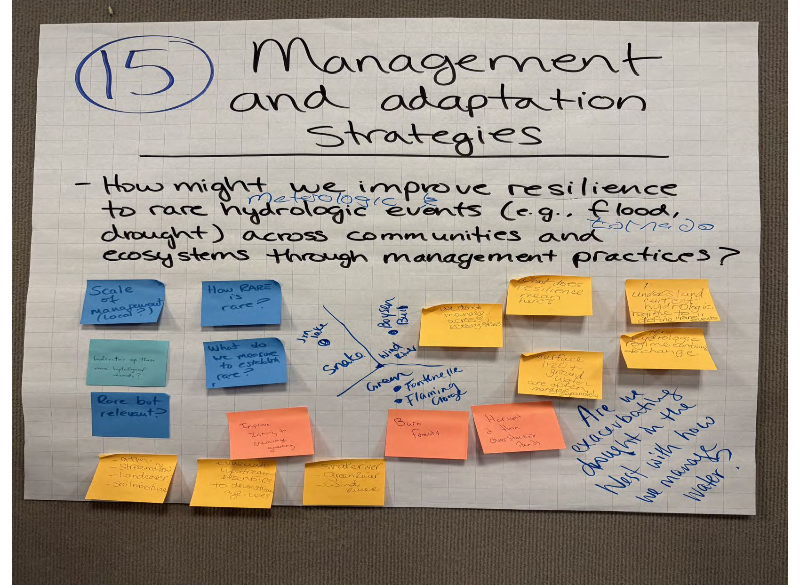

# Group Notes — Resilience for Rare Hydrologic Events Management

Use this shared notebook to capture meeting highlights, decisions, and follow-up tasks for Innovation Summit Group 15.

- Summarize key takeaways after each working session.
- Note data sources, analysis ideas, and open questions.
- Assign owners and due dates for action items so nothing slips through the cracks.
- Drop helpful links, screenshots, or file references so the team can find them later.

## Questions

- How are current river management practices affecting communities and ecosystems?
- What is the response of river communities and ecosystems to hydrologic and meteorologic events?
- How do we measure response and resilience?

Original question:

- How might we improve resilience (define?) to rare hydrologic and meteorologic events (e.g. flood, drought, tornado) across communities and ecosystems through management practices?

## Study Area

- Green, Snake and Wind Rivers and their watersheds
  - Snake: resist due to protect property
  - Wind: accept due to Tribal influence
  - Green: direct via ag practices
- bounded by second major reservoir for each river
- dams and lakes

## Measurements

- water-drought relationship
- Watersheds and their changes over time.
- Response variables
  - air: atmospheric
  - water: streamflow
  - earth: land cover
  - fire: soil moisture

